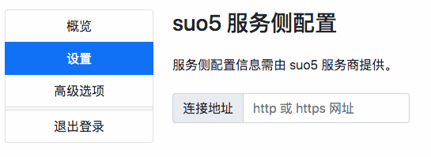
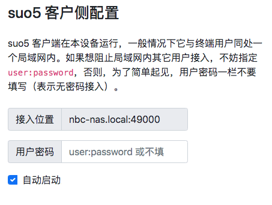

配置 suo5 { .text-center }
-------------------------

&nbsp;

### 两种规格的 suo5 服务

suo5 服务器（也称 Proxy Bridge 节点）提供一个连接地址（称为 target_url），suo5 客户端（也称 Socks5 Handler）用 `-t <target_url>` 指明这个参数启动后，suo5 客户端访问 suo5 服务器的 target_url，两者之间的通信连接就建立了。

假设服务器地址为 `https://example.com/stream`，在 suo5 客户端发起的 `POST https://example.com/stream` 访问即建立起两者之间的通信连接。借助 http 1.1 协议中分块传输编码（Chunked Transfer Encoding）的传输机制，面向同一个互联网目标地址的多个连续请求，可在一次 `"POST https://example.com/stream"` 访问中完成。

suo5 服务器既可以只用 `POST <target_url>` 实现近端 Socks5 Handler 与远端 Proxy Bridge 的数据连接，还可以额外支持用 `GET <target_url>` 实现针对代理通道的存活检查。这两种访问规格中，前者必需提供，后者可选提供。本节介绍两者均提供时如何配置，如果只提供前者，如何适配将在 [“4. 高级用法”](#4) 一节介绍。

&nbsp;

### 最简配置

正常情况下，在 suo5 服务提供商告知远端 target_url 地址后，用户在如下界面填入这个网址，然后点击 “提交更改” 按钮，与 suo5 服务侧相关的配置就完成了。这时，其它配置项均取缺省值。



&nbsp;

### 获取 socks5 侦听地址

然后，我们从配置界面可查得近端 socks5 的接入地址，如下图，接入地址是 `nbc-nas.local:49000` 。



这个地址表明：当前 suo5 客户端程在 `nbc-nas.local` 机器起动并在 49000 端口侦听 TCP 连接。

不妨用 `curl` 命令验证 socks5 代理能否连通。

``` bash
curl -x socks5h://nbc-nas.local:49000 https://www.google.com/
```

说明：上图中 “自动启动” 选项表示，如果 suo5 客户端尚未运行，本工具会自动启动。本选项配合 “存活检查” 产生的效果是，如果 socks5 代理失效了，系统将自动重起 suo5 客户端程序。 

&nbsp;

### 指定用户名与密码

如上图，我们还可以为 socks5 接入指定 “用户密码”，比如输入 "guest:123456"，更改生效后，用 curl 访问如下：

``` bash
curl -U guest:123456 -x socks5h://nbc-nas.local:49000 https://www.google.com/
```

如果用户所处的局域网是多人共用的，为安全起见，若想阻止其它用户接入，不妨配置 “用户密码” 选项。否则，为了简单起见，这个字段可以不填写，未填写时表示当前不设访问控制。

说明：支持用户发起代理隧道访问的工具，除了 curl 我们还推荐使用 `proxychains-ng`，详情请参考 [rofl0r/proxychains-ng](https://github.com/rofl0r/proxychains-ng)。

&nbsp;
