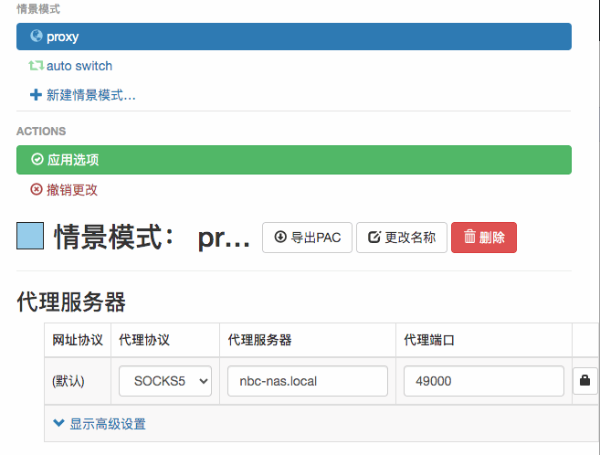

配置浏览器插件 { .text-center }
----------

&nbsp;

### 安装 SwitchyOmega 插件

业界有多种浏览器插件提供 socks5 代理访问，我们推荐使用 SwitchyOmega 插件，这是 github 的一个 [开源项目](https://github.com/FelisCatus/SwitchyOmega)，该插件在 Chrome 与 Edge 浏览器均可安装，另据项目站点介绍，针对 Firefox 的插件也有试验版推出。

安装该插件的过程比较简单，以 Chrome 浏览器为例，先在网页打开扩展程序管理器（`chrome://extensions/`），如下图，搜索到 SwitchyOmega 后，点击按钮完成安装即可。

然后点击浏览器的 “扩展程序” 图标，在如下弹出窗口中，选择 SwitchyOmega 插件，点击右侧 “别针” 图标，将该插件固定在浏览器工具栏位置，方便以后操作 SwitchyOmega。

&nbsp;

### 在 SwitchyOmega 配置 socks5 代理

接上面操作，在浏览器的工具栏点击 SwitchyOmega 图标，选择 “选项” 菜单栏后，进入配置界面。

如下图，我们只需在 “代理服务器” 一栏下，选择 socks5 协议，将上一节我们已获知的 socks5 侦听地址 `nbc-nas.local:49000` 填到代理服务器与代理端口。

之后，点击 “应用选项” 按钮让刚填写的配置生效。

&nbsp;

### 切换情景模式

当我们需要使用 http 代理时，点击工具栏的 SwitchyOmega 图标，系统将弹出如下菜单。

选择 “proxy” 菜单项表示启用上面我们已配置的 proxy 代理，否则，如果选择 “直接连接” 表不启用 proxy 代理。

&nbsp;
