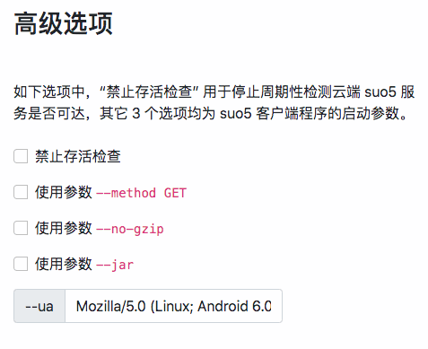

高级用法 { .text-center }
----------

&nbsp;

### 更改 suo5 客户端启动参数

在本工具的 “高级选项” 一栏，可以配置 suo5 客户端的启动参数。

如下图，“--method GET”、“--no-gzip”、“--jar” 可选配置，这 3 个选项缺省不启用，“--ua” 用来指定访问  suo5 服务侧 target_url 时所用的 User Agent 信息。以上各选项具体含义请大家参考 [suo5 项目](https://github.com/zema1/suo5) 的 README 文档。

某些 suo5 服务端程序不支持 POST 方法提供数据通道，而仅支持 GET 方法，这时，需将 `--method GET` 选项置上。

&nbsp;

### sou5 服务不支持存活检查时，如何配置？

存活检查用于检测 suo5 服务是否工作正常，遇到连续 3 次检测失败，本工具（`tr-client` 的 suo5 插件）将自动尝试重起 suo5 客户端程序。

如果 suo5 服务端的连接地址（target_url）不支持存活检查，用户应设置 “禁止存活检查” 选项（见上图）。否则，如果不禁止本项检查，因为存活检查会失败，这必然导致 suo5 客户端程序自动退出。

&nbsp;
